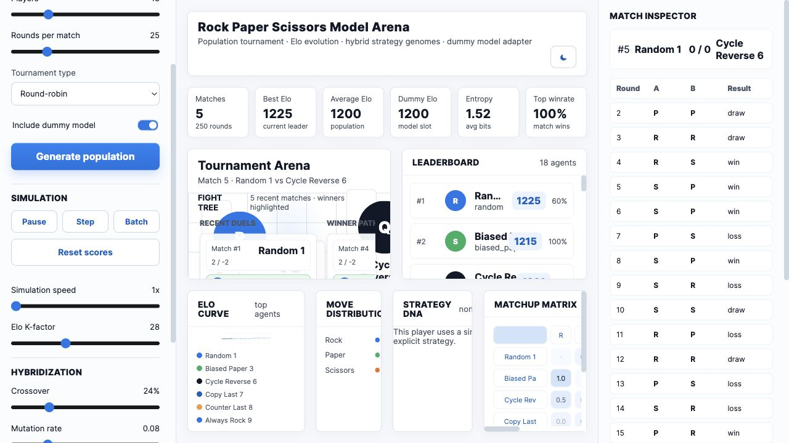

# RPS AI Arena

Interactive Rock Paper Scissors arena for simulating and comparing scripted, adaptive, learning, and hybrid agents.

## Live Demo

[Open the Vercel deployment](https://rps-arena-ten-lemon.vercel.app)



## Features

- Run tournaments with round-robin, Swiss, knockout-like, and continuous league modes.
- Tune player count, rounds per match, tournament speed, and strategy mix.
- Track Elo, winrate, move distribution, matchup matrix, and strategy DNA.
- Inspect players, recent matches, and hybrid strategy genomes.
- Import/export arena state as JSON.

## Run Locally

```bash
npm install
npm run dev
```

Open the Vite URL printed in the terminal, usually:

```text
http://localhost:5173/
```

## Build

```bash
npm run build
```

## Project Structure

```text
src/
  App.tsx
  engine/          Arena state and strategy logic
  components/      Controls, charts, leaderboard, inspector
  styles.css
```
